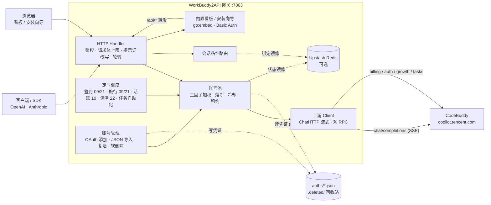

<p align="center">
  <b>如果您感觉本项目满足您的预期，欢迎打赏 ❤️</b>
</p>

<p align="center">
  
</p>

---

<p align="center">
  
</p>

<h1 align="center">WorkBuddy2API</h1>

<p align="center">
  <b>把腾讯 CodeBuddy 账号变成 OpenAI / Anthropic 兼容 API 的多账号网关</b><br>
  OAuth 登录 · 账号池轮转 · 熔断与冷却 · 会话粘性 · 三种协议入口 · 内置看板 · 任务自动化
</p>

<p align="center">
  
  
  
  
  
</p>

---

## 🙏 致谢上游

本项目是 **[Sliverkiss/workbuddy2api](https://github.com/Sliverkiss/workbuddy2api)** 的二次开发分支。

**上游作者完成了整个项目的内核，本分支是在其坚实基础上做增量。** 具体来说，以下能力**全部来自上游**，本分支直接受益：

- **账号池治理** —— 三因子加权随机选号（积分占比 ×10 + 闲置补偿 + 成功率 ×3）、Top-5 候选、防惊群、在途租约限流
- **流量治理** —— 软限流冷却与指数退避、错误分类与账号处置、连续失败熔断
- **请求链路** —— 出站统一改写管线、SSE 帧按规范重建、非流式本地聚合
- **内容安全两层防护** —— 系统提示词体系 + 出站指纹脱敏
- **定时积分任务** —— 签到 / 活跃上报 / 猫猫旅行 / token 保活
- **双域适配**、**辅助工具链**（`login` / `credit` / `signin`）

没有上游扎实的架构与实现，就不会有本分支的这些扩展。**在此向上游作者致谢。**

| | |
|---|---|
| 上游仓库 | https://github.com/Sliverkiss/workbuddy2api |
| 上游作者 | [Sliverkiss](https://github.com/Sliverkiss) |
| 上游许可 | MIT License |

> 再分发时请保留上游的 MIT 版权声明，并注明原始出处。详见 [License](#license)。

## 项目简介

WorkBuddy2API 是一个自托管的**多协议 AI 网关**，把腾讯 CodeBuddy（`copilot.tencent.com`）账号包装成统一的 OpenAI / Anthropic 兼容服务，并内置一个可视化管理看板。

- 官方不提供 OpenAI 形态的开放 API，本项目通过 **OAuth 设备授权**获取账号凭证，在网关侧做 token 自动刷新、账号池调度与流量治理；
- **三种协议入口**：`/v1/chat/completions`（通用）、`/v1/responses`（Codex）、`/v1/messages`（Claude Code）——三家客户端都能**直连零改造**；
- **内置看板**（同容器同端口）：账号池健康度、积分趋势、token 用量、调用流水、任务中心，并支持网页授权登录 / JSON 导入 / 删除账号；
- 面向 **个人多账号** 场景：多账号共享、单号故障自动换号、冷却 / 熔断防止雪崩、会话粘性保证多轮上下文不跳号。

> ⚠️ 合规须知：本项目是**非官方**网关，使用 CodeBuddy 账号作为上游，**仅限本人授权账号、本机 / 私有环境测试**。详细边界见[安全与合规](#安全与合规)。

## ✨ 本分支新增能力

以下功能在上游基础上新增（改动范围见[变更记录](#变更记录)）：

| 能力 | 说明 |
|---|---|
| 🖥️ **内置可视化管理看板** | 与网关**同容器同端口**（`GET /`），`go:embed` 打进二进制。含账号列表、Token 用量、积分使用趋势、调用流水（分页）、分模型用量、可用模型、任务中心。HTTP Basic Auth 保护，**看板凭据与 `api_key` 相互独立**——把看板给运维同事不必交出 API 密钥 |
| 🧙 **Web 安装向导** | 首次启动打开浏览器即可完成初始化：设置看板账号密码、自动生成强随机 `api_key`（也可自带）、一键落盘 `config.json`。装完后 `/setup/install` 立即 **404**，不残留攻击面 |
| 🔑 **网页化账号管理** | ① 网页 **OAuth 授权登录**（推荐，token 不过浏览器）② **JSON 导入**（粘贴 / 拖入文件，支持批量与多形态）③ 手工放 `auths/`。配套**一键复活**被禁账号与**软删除**（凭据移入 `auths/.deleted/` 回收站，误删可恢复） |
| 🔀 **多协议入口** | 在原生 chat completions 之外，实现 `/v1/responses`（Codex 只认此端点）与 `/v1/messages`（Claude Code 只认此端点）的**双向协议转换**，三条路径共用同一账号池与轮转管线；流式 / 非流式均支持，含 Anthropic 思维链 content_block 顺序约束 |
| 🧰 **任务中心（任务自动化）** | 扫描全账号待办任务 → 一键执行 → **后台队列 + worker pool 并发**（`task_concurrency`，按账号计、上限 100）→ 表格**行级实时进度**（排队中 / 执行中 / 已完成 / 失败原因 / 跳过原因）。支持**定时自动执行**（`task_hours`）。刷新页面自动恢复进度，不会"进度丢了" |
| 📥 **多形态账号导入** | 兼容嵌套形、扁平 camelCase、扁平 snake_case、`{"accounts":[...]}` 包装、以及 **`顶层 token + accounts[] 元信息`**（Web 控制台导出）五种形态；`expires_at` 毫秒时间戳自动归一到秒 |
| 🧪 **本地调试工具链** | `dev.sh` / `dev.ps1`（构建 + 运行 + `-w` 热重启）、`reset-dev.ps1`（重置为未安装状态）、`config.dev.json`（真·未安装 + 定时全关），**不需要 Docker** |
| 🔬 **离线端到端验证** | `scripts/e2e_stub/` 假上游 + harness + **errstub 错误注入**（按请求回 402/429/404/500/内容拦截/12153）+ TLS stub，用于验证错误分类与账号处置路径 |

## 核心能力

| 能力 | 说明 |
|---|---|
| 🔑 **三种账号导入** | 网页授权登录 / JSON 导入（多形态 + 批量）/ 手工放 `auths/` |
| 🖥️ **内置看板** | 同容器同端口（`GET /`），Basic Auth 保护，凭据与 `api_key` 分离 |
| 🔄 **多账号池** | 三因子加权随机选号，Top-5 候选 + 防惊群 |
| 🧰 **账号运维** | 一键复活被禁账号、软删除（移入 `auths/.deleted/`，可恢复） |
| 🛡️ **熔断与冷却** | 429 软冷却 600s 起指数退避（封顶 `soft_rate_max`）、404 固定 60s 短冷却、402 硬冷却至次日 04:00、连续失败熔断、在途租约限流 |
| 🧲 **会话粘性** | 同一会话（`conversation_id`）尽量绑定同一账号，TTL 滚动续期，失败自动解绑，可镜像 Redis 防重启丢失 |
| ⏰ **定时任务** | 签到（09/21 点）+ 活跃上报（10 点）+ 猫猫旅行（09/21 点）+ token 保活（22 点），四类独立开关；另有任务自动化排程 |
| ⚡ **多协议入口** | 原生 chat completions + `/v1/responses`（Codex）+ `/v1/messages`（Claude Code），共用同一账号池 |
| ⚡ **流式 + 非流式** | 出站强制 `stream:true`；SSE 帧按规范白名单重建；非流式由本地聚合为单响应 |
| 🧠 **推理模型兼容** | DeepSeek 思维链注入（`thinking.type=enabled` + 默认档）、`reasoning_content` 多轮回填、effort 档位自动降级 |
| 💬 **系统提示词体系** | 网关自有提示词替换客户端 system（默认 `custom`），从源头消灭 system 来源的内容误报；`passthrough` 遇拦截自动降级重试 |
| 🗑️ **指纹脱敏** | 出站请求体黑名单指纹字段清洗（可关闭），与提示词体系两层叠加 |
| 📊 **可观测** | 每请求一行表格日志（TTFB / token 速率 / uid）；`/healthz` 带 `service` 身份标识可接负载均衡 / 宿主探活 |
| 💾 **状态持久化** | 池状态本地原子落盘 + Upstash Redis 异步镜像（可选），重启择新恢复 |
| 🧰 **任务中心** | 扫描待办 → 一键执行 → 后台队列（并发可配）→ 行级实时进度；支持定时自动执行 |

## 架构总览



上游请求在出站前经历统一的改写管线（`internal/upstream/payload.go`）：强制 `stream:true`、`developer` 角色归一、tool_choice 归一、DeepSeek 思维链注入、`reasoning_effort` 档位降级、`reasoning_content` 回填、指纹脱敏。

## 快速开始

### 环境要求

- Docker 与 Docker Compose（推荐），或 Go 1.23+（源码构建）
- 一个本人持有且已授权的 CodeBuddy 账号

### Docker Compose 一键部署

```bash
git clone <本仓库地址>
cd workbuddy2api

# 启动服务
docker compose up -d

# 健康检查（无可用账号时 503）；service 字段用于确认打到的是本网关
curl -s http://localhost:57863/healthz
# {"healthy":2,"total":3,"service":"workbuddy2api"}
```

> **首次使用**：浏览器打开 `http://<host>:57863/`（本仓库 compose 将容器内 `7863` 映射到宿主机 `57863`），会自动进入 **Web 安装向导** —— 设置看板账号密码（`api_key` 可留空自动生成），提交后凭据落盘 `config.json`，看板立即可用。

> ⚠️ **务必让 `config.json` 可写**：安装向导需要把凭据写回 `config.json`。若以 `:ro` 只读方式挂载，向导会**提示安装成功但落盘失败** —— 表现是「`GET /` 变成 401」「重启后又回到安装向导」「反复安装却总装不上」。正确做法见下方 compose 片段。

标准的 `docker-compose.yml`：

```yaml
services:
  wb2api:
    build: .
    container_name: workbuddy2api
    restart: unless-stopped
    environment:
      - TZ=Asia/Shanghai
      # 内置看板凭据（可选）。两者都非空才启用看板。
      # 建议放 .env（已在 .gitignore 忽略），不要把密码写进本文件。
      - WB2A_DASHBOARD_USER=${WB2A_DASHBOARD_USER:-}
      - WB2A_DASHBOARD_PASS=${WB2A_DASHBOARD_PASS:-}
    ports:
      - "57863:7863"
    volumes:
      - ./auths:/app/auths
      - ./data:/app/data
      - ./config.json:/app/config.json      # ⚠️ 不要加 :ro，否则安装向导无法落盘
```

若选择「配置文件必须只读」的部署方式，请改用环境变量提供看板凭据（此时向导自动关闭）：

```bash
# .env
WB2A_DASHBOARD_USER=admin
WB2A_DASHBOARD_PASS=<强随机密码>
```

### 源码构建

```bash
go build -o wb2api ./cmd/server
./wb2api -config ./config.json
```

### 本地调试（不需要 Docker）

```bash
./dev.sh          # 构建 + 运行
./dev.sh -w       # 热重启（改代码自动重启）
./reset-dev.ps1   # 重置为未安装状态（Windows）
```

`config.dev.json` 是"真·未安装 + 定时任务全关"的调试配置。

### 验证

```bash
# 模型列表
curl -s http://localhost:57863/v1/models -H "Authorization: Bearer your-api-key"

# 账号状态（汇总 + 每账号详情，disabled 账号透出 disabled_reason）
curl -s http://localhost:57863/status -H "Authorization: Bearer your-api-key"

# 流式聊天
curl -s http://localhost:57863/v1/chat/completions \
  -H "Authorization: Bearer your-api-key" \
  -H "Content-Type: application/json" \
  -d '{"model":"auto","stream":true,"messages":[{"role":"user","content":"你好"}]}'

# Responses API（Codex 直连）
curl -s http://localhost:57863/v1/responses \
  -H "Authorization: Bearer your-api-key" -H "Content-Type: application/json" \
  -d '{"model":"auto","input":"你好","stream":true}'

# Messages API（Claude Code 直连，注意用 x-api-key）
curl -s http://localhost:57863/v1/messages \
  -H "x-api-key: your-api-key" -H "anthropic-version: 2023-06-01" \
  -H "Content-Type: application/json" \
  -d '{"model":"auto","max_tokens":100,"messages":[{"role":"user","content":"你好"}]}'

# 看板（浏览器打开；未配置 dashboard 凭据时进入安装向导）
# http://localhost:57863/
```

## 配置说明

**`config.example.json` 是配置项最完整的参考**：每个字段、默认值与结构都能在其中找到，示例值一律是 `test_key` 之类占位符，**不含任何真实密钥**。下表为字段含义速查。

### 字段速查

| 字段 | 默认 | 说明 |
|---|---|---|
| `listen` | `:7863` | HTTP 监听地址 |
| `api_key` | 空 | 单个网关鉴权密钥（历史字段，保留以兼容老配置）；**空 = 不鉴权直接放行**（公网必须设置） |
| `api_keys` | `[]` | **多个**网关鉴权密钥。与 `api_key` **合并生效**（任一命中即放行） |
| `auth_dir` | `./auths` | 账号凭证目录 |
| `state_file` | `./data/state.json` | 账号池状态持久化文件 |
| `server.max_body_mb` | `8` | 聊天请求体大小上限（MB，0 / 负数启动报错）。超限直接返回 **413 `request_body_too_large`** |
| `cooldown.soft_rate` | `600s` | 软限流（429 / 限流文案）冷却基数；连续触发按 2 倍指数退避 |
| `cooldown.soft_rate_max` | `2h` | 软冷却指数退避封顶 |
| `schedule.checkin_hours` | `[9, 21]` | 每日本地时区整点签到 + 余额查询解冻 |
| `schedule.travel_hours` | `[9, 21]` | 每日本地时区整点推进猫猫旅行状态机（领养 / 派出 / 领奖） |
| `schedule.activity_hours` | `[10]` | 每日本地时区整点对话活跃上报 |
| `schedule.keepalive_hours` | `[22]` | 每日本地时区整点刷新 token 保活 |
| `schedule.checkin_enabled` | `true` | 签到总开关 |
| `schedule.travel_enabled` | `true` | 猫猫旅行总开关（独立于签到） |
| `schedule.activity_enabled` | `true` | 活跃上报总开关 |
| `schedule.keepalive_enabled` | `true` | token 保活总开关 |
| `schedule.task_hours` | `[10]` | 任务中心自动执行队列的触发时点 |
| `schedule.task_enabled` | `true` | 任务自动化排程总开关 |
| `schedule.task_concurrency` | `10` | 任务队列并发度（**按账号**计，账号内仍串行）。上限 **100**，超过钳到上限；`0` / 负数回落 10。看板「全部执行」与定时自动跑**共用本值** |
| `upstream.timeout_seconds` | `120` | 短 RPC（刷新 / 签到 / 余额 / 模型列表）总时长上限 |
| `upstream.header_timeout_seconds` | 回落 `timeout_seconds` | 聊天首字节前（响应头）上限 |
| `upstream.idle_timeout_seconds` | `300` | 聊天流中空闲上限（活跃续命，静默断流） |
| `upstream.user_agent` | 空 | 出站 User-Agent 覆盖（空 = 现状 `CLI/2.63.2 CodeBuddy/2.63.2`） |
| `features.sanitize_blacklist_fingerprints` | `true` | 出站请求体黑名单指纹脱敏 |
| `prompt.mode` | `custom` | 系统提示词模式：`custom` = 网关用自有提示词替换客户端 system；`passthrough` = 透传客户端原始 system（降级重试仍切中性提示词） |
| `prompt.file` | 空 | 提示词文件路径；空 = 内置默认；路径非空但不可读 → 启动报错 |
| `dashboard.user` / `dashboard.pass` | 空 | 内置看板的 Basic Auth 凭据；**两者都非空才启用看板**，否则退化为纯 API 网关（或进入安装向导） |
| `upstash.url` / `upstash.token` | 空 | 空 = 纯内存模式（Noop 降级，功能照常） |
| `pool.max_in_flight` | `3` | 单账号最大在途请求数（`0` = 不限） |
| `pool.breaker_threshold` | `3` | 连续失败触发熔断阈值 |
| `pool.breaker_cooldown` | `30m` | 熔断基础退避时长 |
| `pool.breaker_cooldown_max` | `6h` | 熔断指数退避封顶 |
| `pool.idle_weight_per_hour` | `0.5` | 闲置补偿：每小时未使用 +0.5 权重 |
| `pool.idle_weight_max` | `5.0` | 闲置补偿权重封顶 |
| `session_sticky.enabled` | `true` | 会话粘性路由开关 |
| `session_sticky.ttl` | `30m` | 会话绑定 TTL（滚动续期） |
| `session_sticky.gc_interval` | `5m` | 过期绑定 GC 周期 |

### 上游超时语义（三段各归其位）

| 字段 | 作用对象 | 默认 | 行为 |
|---|---|---|---|
| `timeout_seconds` | 短 RPC（token 刷新 / 签到 / 余额 / 模型列表） | `120` | 总时长硬上限，到期报错走换号 / 熔断 |
| `header_timeout_seconds` | 聊天 SSE **首字节前** | `120` | 由 `Transport.ResponseHeaderTimeout` 约束；超时 = 换号重发 |
| `idle_timeout_seconds` | 聊天 SSE **流中空闲** | `300` | 活跃吐数据续命不掐；静默超时才断流释放租约 |

聊天流（`stream` true / false 均同）**没有总时长上限**：聊天使用 `Timeout=0` 的专用 client，长思考 / 长输出不会被掐断。

### 环境变量覆盖

加载顺序：JSON 文件 → `WB2A_*` 环境变量（变量非空才覆盖）：

`WB2A_LISTEN` · `WB2A_API_KEY` · `WB2A_AUTH_DIR` · `WB2A_STATE_FILE` · `WB2A_MAX_BODY_MB` · `WB2A_SOFT_RATE`(duration) · `WB2A_SOFT_RATE_MAX`(duration) · `WB2A_TIMEOUT_SECONDS` · `WB2A_HEADER_TIMEOUT_SECONDS` · `WB2A_IDLE_TIMEOUT_SECONDS` · `WB2A_USER_AGENT` · `WB2A_SANITIZE_FINGERPRINTS`(bool) · `WB2A_PROMPT_MODE` · `WB2A_PROMPT_FILE` · `WB2A_DASHBOARD_USER` · `WB2A_DASHBOARD_PASS`

> 一旦设置了 `WB2A_DASHBOARD_USER` / `WB2A_DASHBOARD_PASS`，网关即视为"已安装"，**安装向导自动关闭**。

## 核心行为语义

### 系统提示词体系

客户端（Claude Code / Codex 等 CLI）会在 system prompt 注入固定模板句，上游内容审核按**逐字精确匹配**误杀合法流量（HTTP 400 + 审核文案）。网关提供两层防护，互不替代：

1. **提示词体系**（解决 **system / developer 来源**的误报）：由 `prompt.mode` 控制
2. **指纹脱敏**（兜底 **用户 / assistant 消息**里的指纹串）：由 `features.sanitize_blacklist_fingerprints` 控制

### 错误分类与账号处置

| 上游信号 | 处置 |
|---|---|
| 429 / 限流文案 | 软冷却（600s 起指数退避，封顶 `soft_rate_max`） |
| 402 | 硬冷却至次日 04:00（额度耗尽） |
| 404 | 固定 60s 短冷却 |
| 12153（session 失效） | 走 `NoteSessionDead`，**连续 3 次**才禁用账号 |
| 连续失败达阈值 | 熔断（指数退避，封顶 `breaker_cooldown_max`） |

### 选号策略

三因子加权随机：`积分占比 ×10 + 闲置补偿 + 成功率 ×3`，取 Top-5 候选后随机，并做防惊群。

### 会话粘性

同一 `conversation_id` 尽量绑定同一账号，TTL 滚动续期；失败自动解绑重选；可镜像 Upstash Redis 防重启丢失。

### 定时任务

四类任务**独立排程、独立开关**，互不影响：

- **签到**（09 / 21 点）—— 每日签到 + 余额查询，余额恢复自动解冻冷却账号
- **活跃上报**（10 点）—— 对话事件连发上报，点亮连登天数、解锁领养前置，回读 streak 自检
- **猫猫旅行**（09 / 21 点）—— 独立排程：领养 / 派出 / 领奖闭环推进
- **token 保活**（22 点）—— 全账号刷新 token，session 失效连续 3 次才禁用

另有**任务自动化**排程（`task_hours`），详见[任务中心](#任务中心任务自动化)。

## 任务中心（任务自动化）

看板「任务中心」是把上游的任务接口**产品化**的模块：

1. **扫描** —— 遍历全部账号，列出可执行的待办任务（`GET /tasks/scan`）
2. **一键执行** —— 点「▶️ 全部执行」后**立即返回**，队列在后台跑（`POST /tasks/queue`）
3. **后台队列 + 并发** —— worker pool 实现，**并发度按账号计**（账号内任务串行），默认 10、上限 100，由 `schedule.task_concurrency` 控制
4. **行级实时进度** —— 表格每行状态随队列推进：`待完成` → `⏳ 执行中…` → `✅ 已完成` / `❌ 失败 · <原因>` / `⏭ 已跳过 · <原因>`；顶部同时显示进度文字

**看板手动**与**定时自动**两条路径**共用同一并发度配置**。

**刷新页面不丢进度**：队列状态在后端，页面加载时会主动查询一次并恢复轮询；已结束则显示上次最终结果。

> 为什么"已完成的任务还会被执行一遍"：扫描结果是某一时刻的快照，队列开始跑之后上游任务状态可能已变，因此执行阶段仍会逐条判定，已失效的记为「跳过」并在行内给出原因。

## API 端点

> 鉴权规则：只要**配过** API Key 就校验凭据，两种头**任一带对即放行** —— `Authorization: Bearer <key>`（OpenAI 系客户端）或 `x-api-key: <key>`（Anthropic 系客户端，Claude Code 只发这个头）。**支持多个 Key 并行有效**，任一命中即通过（见 [API Key 管理](#api-key-管理多-key)）；`/healthz` 恒无鉴权。
>
> **鉴权开关的两种边界**（都已实测）：
> - **从未配置任何 Key** → 不鉴权，所有端点直接放行（保留历史语义，老配置升级后不会被锁死）；
> - **配置过但全部被吊销** → **拒绝一切请求**（fail-closed）。这是刻意的：吊销泄露的 Key 是收紧动作，绝不能反过来让网关变成"无 Key 即不鉴权"而彻底敞开。

### 协议端点

| 端点 | 说明 |
|---|---|
| `POST /v1/chat/completions` | OpenAI Chat Completions（通用） |
| `POST /v1/responses` | OpenAI Responses API（**Codex v0.154+ 只认此端点**） |
| `POST /v1/messages` | Anthropic Messages API（**Claude Code 只认此端点**） |
| `POST /responses` · `POST /messages` | 上述两者的无 `/v1` 前缀别名（部分客户端行为差异） |

### 服务端点

| 端点 | 说明 |
|---|---|
| `GET /v1/models` | 模型列表 |
| `GET /status` | 账号池汇总 + 每账号详情（禁用账号透出 `disabled_reason`） |
| `GET /credits` | 各账号实时积分余额 |
| `GET /credits/history` | 积分快照历史（看板趋势图用） |
| `GET /calls` | 调用流水（支持分页） |
| `GET /stats` | 用量统计 |
| `GET /healthz` | 探活（无可用账号 503），带 `service` 身份标识 |

### 账号管理端点（看板「添加账号」用）

| 端点 | 说明 |
|---|---|
| `POST /accounts/login/start` | 发起 OAuth 设备授权 |
| `GET /accounts/login/poll` | 轮询授权结果 |
| `POST /accounts/import` | 导入账号（多形态 JSON，支持批量，逐条返回结果） |
| `POST /accounts/export` | **导出完整凭证**（含明文 token）用于备份 / 迁移；需传 `{"confirm":"EXPORT"}` |
| `POST /accounts/{uid}/revive` | 复活被禁账号 |
| `DELETE /accounts/{uid}` | 软删除（凭据移入 `auths/.deleted/`） |

#### 导出凭证（备份 / 迁移）

看板账号列表右上角「⬇ 导出凭证」，或直接调 `POST /accounts/export`：

```bash
curl -X POST http://localhost:7863/accounts/export \
  -H "Authorization: Bearer <api_key>" -H "Content-Type: application/json" \
  -d '{"confirm":"EXPORT"}' -o accounts-backup.json
```

- 输出为**嵌套形 JSON 数组**，与 `auths/workbuddy-*.json` 同构，可直接被
  「导入 JSON」读回（**往返已验证**：导出 → 清空 auths → 导入 → token 无损恢复）；
- 导出范围 = **当前池内账号**（与看板列表同源，token 取内存最新值）；
  `auths/.deleted/` 回收站内的账号**不在**导出范围；
- 空 token 的账号会被跳过（导出也导不回来，避免备份文件"看起来有这条"）；
- 响应头带 `Content-Disposition`（文件名含时间戳）与 `Cache-Control: no-store`；
- 日志只记条数，**绝不记 token**。

> ⚠️ **安全边界变更（务必知悉）**：本项目对 OAuth 登录流程有一条硬边界——
> **token 全程不经过浏览器**（见 `internal/server/accounts.go` 文件头注释）。
> 导出功能**有意突破该边界**：要让凭证落到你的下载目录，就必须经过浏览器。
> 之所以可接受：反方向的「导入 JSON」本就允许 token 经浏览器上行，导出只是把
> 同一条通路补齐为双向，未引入新的信任假设。
>
> **代价**：导出文件是**不可再生的凭证**，泄露等同于交出账号。请勿放入
> 共享盘 / 网盘同步目录 / 版本库，用后及时转移或删除。故导出需**手输确认短语**，
> 且受 `api_key` 鉴权保护（与其他账号端点同口径）。


### 任务端点

| 端点 | 说明 |
|---|---|
| `GET /tasks/scan` | 扫描全账号待办任务 |
| `POST /tasks/run` | 执行单个账号的单个任务 |
| `POST /tasks/queue` | 启动后台队列（并发度可配） |
| `GET /tasks/queue` | 查询队列状态（行级进度） |
| `GET /tasks/list` | 任务定义列表 |

### 保活端点

| 端点 | 说明 |
|---|---|
| `POST /keepalive` | **立即刷新全部账号 token**（看板「💓 保活」按钮） |

```bash
curl -X POST http://localhost:7863/keepalive \
  -H "Authorization: Bearer <api_key>"
# {"ok":true,"total":3,"ok_count":3,"fail_count":0,"skip_count":0,
#  "results":[{"uid":"…","status":"ok","expires_at":1794492000,"extends_days":60.0}, …]}
```

- 与定时 22:00 的保活**共用同一份实现与互斥锁**（`scheduler.KeepaliveAll`）；
  撞车时返回 **409**（而非静默排队），提示"已有一次在跑"；
- 刷新成功即 `SaveAtomic` 落盘；**落盘失败按 fail 回报**（不谎报成功——
  否则重启会回退到旧 token，"保活"成了假象）；
- 禁用账号与无 `refreshToken` 的账号**跳过**（不计失败、不打上游）；
- 12153 仍走**连续 3 次**才禁用的计数语义，刷新成功清零。

**为什么值得一个按钮**：`accessToken` 的寿命**取决于签发方**——实测从
`copilot.tencent.com` 签发的是 **60 天**，而从 `www.codebuddy.cn` 签发的是
**72 小时**（`refreshToken` 分别 90 天 / 7 天）。两者是同一套 Keycloak 的两个入口，
但 token 策略不同。临近过期时手工刷一次即可续期，不必等定时到点或重启进程。

> 刷新响应若带新的 `refreshToken`，网关会一并替换（`client.go` 的 `RefreshToken`），
> 因此**只要保活正常跑，token 可一直滚动续期**，不必定期重新 OAuth 登录。
> 反之若长期停机超过 `refreshToken` 的寿命（特别是 codebuddy.cn 签发的仅 7 天），
> 就必须重新登录。

### 定时任务开关端点

看板「定时任务」区块可**运行时切换**四类排程任务的开关，不必改配置文件重启。

| 端点 | 说明 |
|---|---|
| `GET /schedule` | 列出四类任务的开关与时点 |
| `POST /schedule/{key}` | 切换某类任务，body `{"enabled":true\|false}` |

`key` 取值：`checkin`（签到）/ `travel`（猫猫旅行）/ `activity`（活跃上报）/ `keepalive`（Token 保活）。

```bash
curl -X POST http://localhost:7863/schedule/checkin \
  -H "Authorization: Bearer <key>" -H "Content-Type: application/json" \
  -d '{"enabled":false}'
# {"ok":true,"key":"checkin","enabled":false,"applied":true,"persisted":true}
```

**两条关键语义**：

- **立即生效**：切换会**唤醒调度器**重算下一次触发时刻。否则关掉的任务仍可能在已排的
  时点执行一次，而新打开的任务要等当前休眠到期（最长 12 小时）才排上——开关形同虚设。
  实现见 `scheduler.Scheduler.wake`：`Run` 除「时点到期 / ctx 取消」外还监听该通道。
- **写回 `config.json`**：不同步写盘的话，重启后会回到文件里的旧值，用户会以为"开关失效/
  被重置"。**写盘失败时 `persisted:false` 并附 `persist_error`**，前端如实提示
  "仅内存生效，重启后会回到原值"——不谎报成功。

**只切开关，不动时点**：禁用时 `*_hours` 原样保留，重新启用即恢复原时刻
（与配置文件里 `*_enabled` / `*_hours` 的解耦语义一致）。

> **禁用只影响定时排程，不影响手动操作**：任务中心的「全部执行」、账号列表的「保活」
> 按钮仍可用。所以"临时先别自动跑、但要手动触发"是可行组合。

### API Key 管理（多 Key）

支持**多个 Key 并行有效**，便于按客户端区分与单独吊销——任一 Key 泄露时，只吊销它即可，
不必给所有客户端换 Key（那意味着服务中断）。

**两个来源合并生效**（union，不是覆盖）：

| 来源 | 位置 | 看板操作 |
|---|---|---|
| `config` | `config.json` 的 `api_key` / `api_keys` | 只能**吊销 / 恢复**，不能删除（删了下次启动又读回来） |
| `生成` | `data/api_keys.json` | 可**生成 / 复制 / 吊销 / 删除** |

配置示例（两种写法可共存，会合并去重）：

```jsonc
{
  "api_key":  "sk-main-key",              // 历史字段，保留兼容
  "api_keys": ["sk-laptop", "sk-phone"]   // 多个 Key
}
```

环境变量：`WB2A_API_KEY`（单值）与 `WB2A_API_KEYS`（多个，逗号 / 换行 / 分号分隔，两者都生效）。

| 端点 | 说明 |
|---|---|
| `GET /keys` | 列出全部 Key（含明文，供「复制」；展示默认用掩码） |
| `POST /keys` | 生成新 Key，body `{"name":"备注"}`（备注可选） |
| `DELETE /keys/{key}` | 删除**生成**源的 Key（`config` 源返回 400，应改用吊销） |
| `POST /keys/{key}/disable` | 吊销（立即失效，两种来源通用） |
| `POST /keys/{key}/enable` | 恢复被吊销的 Key |

```bash
# 生成一个 Key
curl -X POST http://localhost:7863/keys \
  -H "Authorization: Bearer <已有key>" -H "Content-Type: application/json" \
  -d '{"name":"laptop"}'
# {"ok":true,"key":{"key":"sk-…","preview":"sk-12345678…4715","name":"laptop","source":"generated","enabled":true}}

# 吊销（立即生效，无需重启）
curl -X POST http://localhost:7863/keys/sk-泄露的那个/disable -H "Authorization: Bearer <已有key>"
```

**看板操作**：「API Key」区块 → 填备注 → 「+ 生成 Key」。新 Key 会**自动复制到剪贴板并展开明文**；
列表默认显示掩码（`sk-12345678…4715`），点「显示」才展开；「复制」直接复制明文。

**为什么吊销用"墓碑"而不是删除**：`config.json` 里的 Key 是声明式配置，进程删不掉它；
若不额外记录吊销状态，用户就无法让一个泄露的 config Key 失效（除非改文件 + 重启）。
墓碑让 config Key 也能一键立即失效——这是 Key 管理的核心能力。

> ⚠️ **安全边界**：`GET /keys` 返回**明文 Key**（「复制」功能需要）。这与既有的
> 「导出凭证」端点同口径——都在看板 Basic Auth 之后，且凭证敏感度不低于 Key。
> 另外 Key 管理端点本身受 `api_key` 鉴权保护（无凭据调用返回 401）。
>
> **fail-closed**：吊销/删除导致**一个可用 Key 都没有**时，网关仍**拒绝**所有请求，
> 不会退回"不鉴权"。否则"清理掉泄露的 Key"反而会把网关敞开——本意收紧却最不安全。
> 只有**从未配置过任何 Key**的部署才不鉴权（兼容历史行为）。

### 看板端点

`GET /` 与 `/api/*` 走 **HTTP Basic Auth**（`dashboard.user` / `dashboard.pass`），**不是** `api_key`。未配置看板凭据时，`GET /` 进入**安装向导**。

## 可视化看板

与网关**同容器同端口**（`GET /`），页面由 `go:embed` 打进二进制。

| 面板 | 内容 |
|---|---|
| Token 用量 | 按时间维度的输入 / 输出 token |
| 积分使用趋势 | 各账号积分快照曲线 |
| 调用流水 | 逐请求明细（分页，每页 10 条） |
| 分模型用量 | 各模型调用占比 |
| 账号列表 | 健康度、积分、状态；支持删除 / 复活 |
| 任务中心 | 扫描 + 一键执行 + 行级进度 |
| 可用模型 | 上游模型清单 |

安全设计：**看板凭据与 `api_key` 分离** —— 把看板给运维同事，不必交出 API 密钥。

## 安全与合规

### 1. 凭据管理（`auths/`）

- 凭证文件权限 `0600`，仅本进程可读
- **软删除**：误删账号的凭据移入 `auths/.deleted/`（带时间戳），手工拷回即可恢复
- **不要把 `auths/` 提交到版本库**（已在 `.gitignore` 排除）
- **不要把 `config.json` 提交到版本库**（含 `api_key` 与看板密码，已在 `.gitignore` 排除）

### 2. 网络暴露与日志敏感度

- 网关默认监听 `0.0.0.0`，**`api_key` 为空时等于无鉴权** —— 公网部署必须先设 `api_key`
- 请求日志字段：序号 / 模型 / 模式 / 状态码 / **uid 前 8 位** / TTFB / token 数 —— **不含** `accessToken` / `refreshToken` / `api_key` 明文（不读取 `Authorization` 头）
- 安装向导装完后 `/setup/install` 返回 **404**，不残留可重放入口

### 3. 授权使用边界

- 上游 CodeBuddy 属腾讯系商业产品，本项目是其**非官方 OpenAI 兼容网关**；使用其账号做 API 网关涉及目标平台服务条款与账号风险，作者不对账号封禁、条款违约或使用结果负责
- 仅使用**本人持有且已获授权**的账号
- 遵守 CodeBuddy 平台服务条款与所在地法律
- 妥善保管 `auths/`（明文凭证）与网关端口

## 常见问题

### 访问 `http://localhost:57863/` 打不开看板？

按以下顺序排查：

1. **未配置看板凭据** → 会进入**安装向导**而非看板。完成安装即可（或设置 `WB2A_DASHBOARD_USER` / `WB2A_DASHBOARD_PASS`）。
2. **配置了凭据** → 会弹 HTTP Basic Auth 登录框。用户名 / 密码是 `dashboard.user` / `dashboard.pass`（**不是** `api_key`）。

### 安装向导装了好几遍，重启后又回到向导？

**根因**：`config.json` 以 `:ro` **只读**方式挂载，向导写盘失败 —— 凭据只存在内存，重启即回滚；而且每次提交都会**轮换 `api_key`**，打断所有使用旧 key 的客户端。

**修复**（两者缺一不可）：

```yaml
# 1. compose 去掉 :ro
- ./config.json:/app/config.json
```

```bash
# 2. 宿主机把文件属主改为容器运行用户（默认 uid 10001）
chown 10001:10001 ./config.json && chmod 600 ./config.json
```

> 仅去掉 `:ro` 而属主仍是 `root` 会报 `permission denied` —— 因为容器以非 root 用户运行。

若希望配置文件保持只读，则改用 `WB2A_DASHBOARD_USER` / `WB2A_DASHBOARD_PASS` 环境变量（向导会自动关闭）。

### 导入 JSON 报解析失败 / 「缺少 access_token」？

支持以下形态，任选其一即可：

1. **嵌套形**（插件 OAuth 输出）：`{"account":{...},"auth":{"accessToken":...}}`
2. **扁平 camelCase**：`{"accessToken":...,"refreshToken":...,"uid":...}`
3. **扁平 snake_case**：`{"access_token":...,"refresh_token":...,"uid":...}`
4. **`{"accounts":[...]}` 包装**：数组内条目自带 token
5. **顶层 token + `accounts[]` 元信息**（Web 控制台导出）：token 在顶层，`accounts[]` 只放账号信息 —— 网关会把顶层 token 补到数组条目上

`expires_at`（毫秒时间戳）会自动归一到秒。

### Codex 报 `404 Not Found ... url: http://host:7863/responses`？

Codex 的 base_url 需指向带 `/v1` 的地址，或确认使用的端点路径。本网关同时提供 `/v1/responses` 与 `/responses`。

### 放了凭证文件，重启后账号没出现？

文件名必须匹配 `workbuddy*.json`，否则**会被静默跳过**：

```bash
# 正确
auths/workbuddy-<uid>.json

# 错误（不会被加载）
auths/my-account.json
```

### 删除账号后能恢复吗？

可以。删除是**软删除**，凭据移入 `auths/.deleted/`（带时间戳前缀）：

```bash
# 恢复：去掉时间戳前缀，拷回 auths/ 并重启
mv auths/.deleted/20260914-102736-workbuddy-xxx.json auths/workbuddy-xxx.json
docker compose restart
```

### 任务执行了但界面没刷新进度？

页面已支持**刷新后自动恢复**队列进度。若仍看不到，请强刷页面（Ctrl+Shift+R）清掉缓存。

## 目录结构

```
cmd/
  server/    # 主服务（config + main + 路由装配）
  login/     # OAuth 登录 CLI（login.sh 调用，与看板共用 internal/oauth）
  credit/    # 积分查询工具
  signin/    # 批量签到工具
  activity/  # 活跃上报一次性触发器
internal/
  auth/      # 凭证解析 + 原子写回 + 多形态 JSON 导入
  oauth/     # OAuth 设备授权协议（CLI 与看板共用）
  pool/      # 账号池（状态机/熔断/租约/加权/持久化）
  panel/     # 任务中心：扫描 + 一键完成 + 执行队列（worker pool 并发）
  scheduler/ # 定时签到 / 旅行 / 活跃 / 保活 / 任务
  server/    # HTTP handler + 三个协议端点（含别名）+ 账号管理 + 内置看板 + 安装向导
  server/dashboard/       # 看板页面（go:embed 打进二进制）
  server/setup_page.html  # 安装向导页面（go:embed）
  session/   # 会话粘性路由
  upstream/  # 上游封装（chat/billing/auth/headers/sse/payload/sanitize/idle/tasks）
  redisstore/# Upstash 持久化 + Noop 降级
scripts/
  e2e_stub/  # 离线端到端验证（假上游 + harness + errstub 错误注入 + TLS stub）
  task_*.py  # 各类任务的独立 Python 参考实现
dev.sh / dev.ps1        # 本地调试（热重启，不需要 Docker）
reset-dev.ps1           # 重置为未安装状态
```

## 变更记录

### 2026-09-14（0914 分支）

**新增能力**

- 🖥️ **内置可视化管理看板** —— 账号列表 / Token 用量 / 积分趋势 / 调用流水（分页）/ 分模型用量 / 可用模型 / 任务中心；Basic Auth，凭据与 `api_key` 分离
- 🧙 **Web 安装向导** —— 浏览器完成初始化，凭据落盘；装完 `/setup/install` 即 404
- 🔑 **网页化账号管理** —— OAuth 授权登录、JSON 导入（多形态 + 批量）、一键复活、软删除
- 🔀 **多协议入口** —— `/v1/responses`（Codex）与 `/v1/messages`（Claude Code），含流式思维链
- 🧰 **任务中心** —— 扫描 / 一键执行 / 后台队列（并发可配）/ 行级实时进度 / 定时自动执行
- 📥 **多形态账号导入** —— 五种 JSON 形态 + `expires_at` 毫秒归一
- 🧪 **本地调试工具链** —— `dev.sh` / `dev.ps1` / `reset-dev.ps1`
- 🔬 **离线端到端验证** —— `scripts/e2e_stub/` 含 errstub 错误注入

**文档**

- 新增本 README 的**上游致谢**与**本分支新增能力**章节
- 补全 `schedule.task_hours` / `task_enabled` / `task_concurrency` 说明
- 新增「任务中心」「可视化看板」章节
- 补充三种协议入口的验证示例
- 补充安装向导落盘问题的排查指引

**与上游的差异**

- 定时任务为**四类**（签到 / 旅行 / 活跃 / 保活）+ 任务自动化；上游的「开学季」「夜猫子」任务未包含在本分支
- 移除上游的 `trial` 相关代码与部分脚本

### 上游历史

上游的完整变更历史请见 [上游仓库](https://github.com/Sliverkiss/workbuddy2api)。

## 免责声明

本项目仅供学习和研究使用。使用者需遵守 CodeBuddy 服务条款，自行承担使用风险（包括账号封禁、条款违约等）。作者不对任何因使用本项目产生的直接或间接损失负责。

- 本项目是**非官方**网关，与腾讯 / CodeBuddy 无任何关联
- 请仅使用**本人持有且已获授权**的账号
- 请勿用于任何商业目的或牟利行为

## License

本项目采用 [MIT License](LICENSE) 开源协议。

- 允许任意使用、复制、修改、合并、发布、分发、再授权及销售
- 再分发（源码或二进制形式）时，请保留**上游仓库**的 MIT 版权声明与许可声明，并注明原始出处：
  `https://github.com/Sliverkiss/workbuddy2api`
- 本项目不授予任何上游（CodeBuddy / 腾讯）接口或服务的权利；使用者仍需自行遵守上游服务条款

---

<p align="center">
  <sub>再次感谢 <a href="https://github.com/Sliverkiss">Sliverkiss</a> 及其上游项目 <a href="https://github.com/Sliverkiss/workbuddy2api">workbuddy2api</a> 的开源贡献 ❤️</sub>
</p>
